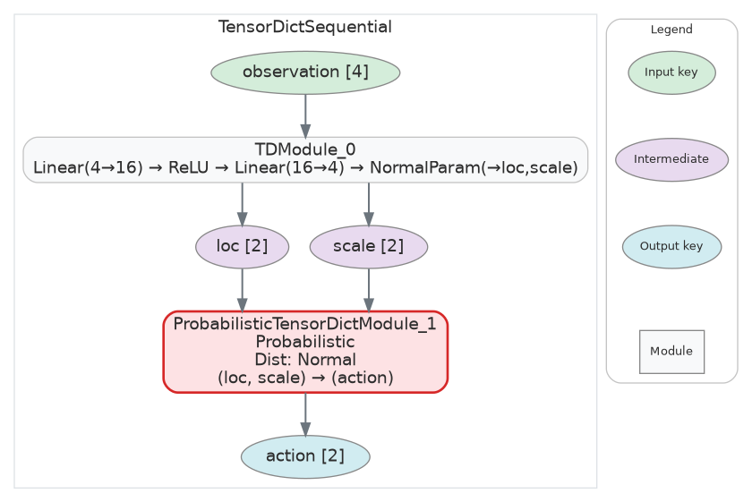
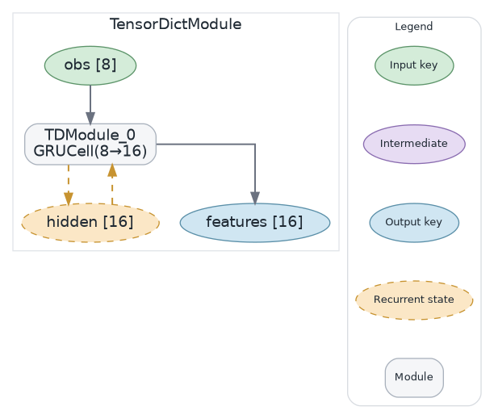
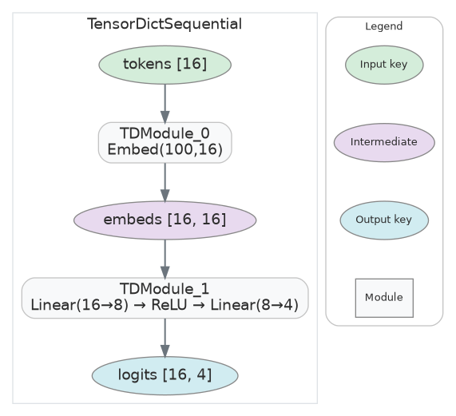
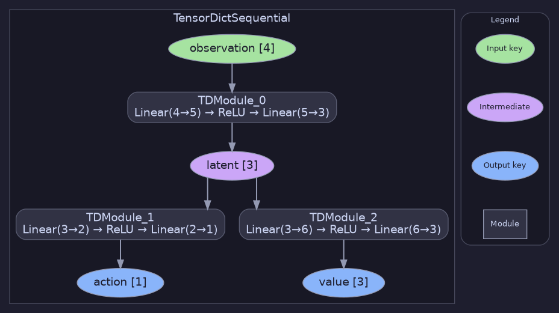
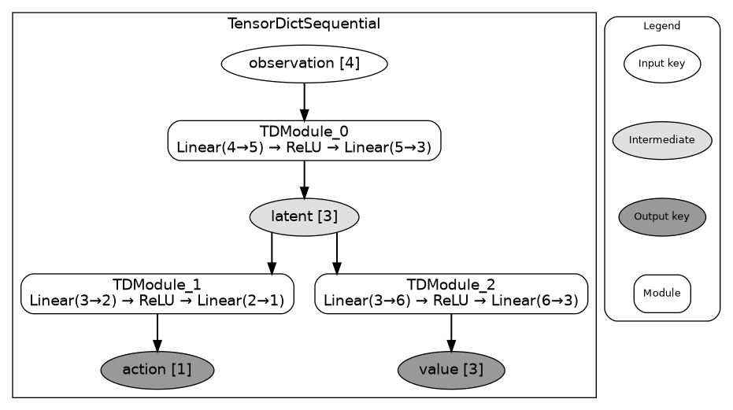

# tensordictviz

Visualize neural network architectures built with [TorchRL](https://github.com/pytorch/rl)'s `TensorDictModule` / `TensorDictSequential` (powered by [TensorDict](https://github.com/pytorch/tensordict)). Renders graph diagrams that show **real** tensor shapes at every key, every module's layer chain, and how data flows between modules.

`print(model)` buries the key-plumbing in nested text. tensordictviz makes it explicit: which modules share inputs, which produce intermediate keys, where the recurrent state loops back.


## Installation

```bash
pip install tensordictviz
```

Requires [Graphviz](https://graphviz.org/download/) installed on your system.

## Quick start

```python
from tensordictviz import visualize
from torch import nn
from tensordict.nn import TensorDictModule, TensorDictSequential

encoder = nn.Sequential(nn.Linear(4, 5), nn.ReLU(), nn.Linear(5, 3))
head_a  = nn.Sequential(nn.Linear(3, 2), nn.ReLU(), nn.Linear(2, 1))
head_b  = nn.Sequential(nn.Linear(3, 6), nn.ReLU(), nn.Linear(6, 3))

model = TensorDictSequential(
    TensorDictModule(encoder, in_keys=["observation"], out_keys=["latent"]),
    TensorDictModule(head_a,  in_keys=["latent"],      out_keys=["action"]),
    TensorDictModule(head_b,  in_keys=["latent"],      out_keys=["value"]),
)

viz = visualize(model)        # captures real shapes via a fake forward pass
viz.view()                    # open in default SVG viewer
viz.save("policy", "png")     # save to disk
```

In a Jupyter notebook, just `visualize(model)` auto-renders inline thanks to `_repr_svg_`.

## What you get

- **Real tensor shapes** captured by a fake forward pass — on every key for TensorDict models, and on every edge (the running shape) for plain `nn.Sequential`.
- **Color-coded key nodes** (green = input, lavender = intermediate, blue = output, yellow-dashed = recurrent state).
- **Layer-chain summaries** for each module: `Linear(4→5) → ReLU → Linear(5→3)`.
- **TorchRL-aware rendering** for `ProbabilisticTensorDictModule`, recurrent modules, and any `TensorDictSequential` subclass.
- **Themes**: `"light"` (default), `"dark"`, `"print"` — or pass a dict for partial overrides.
- **On-diagram legend** explaining the colour code (toggle with `show_legend=False`).
- **20+ layer types** in the registry — Linear, Conv1d/2d/3d, ConvTranspose, BatchNorm, LayerNorm, GroupNorm, Pool, AdaptivePool, Embedding, LSTM/GRU/RNN, MultiheadAttention, Transformer*, Flatten, Dropout, activations. Extend via `@register_layer`.

## Examples

### Probabilistic actor

```python
from tensordict.nn import ProbabilisticTensorDictModule
from tensordict.nn.distributions import NormalParamExtractor
from torch.distributions import Normal

net = nn.Sequential(nn.Linear(4, 16), nn.ReLU(), nn.Linear(16, 4), NormalParamExtractor())
param_mod = TensorDictModule(net, in_keys=["observation"], out_keys=["loc", "scale"])
prob_mod = ProbabilisticTensorDictModule(
    in_keys=["loc", "scale"], out_keys=["action"], distribution_class=Normal,
)
actor = TensorDictSequential(param_mod, prob_mod)
visualize(actor)
```



The probabilistic module is highlighted in red with the distribution class and the (in → out) mapping spelled out.

### Recurrent state (LSTM/GRU)

A key that appears in both `in_keys` and `out_keys` of the same module is rendered as a yellow-dashed **recurrent state**:



### CNN → MLP with real shapes

```python
cnn = nn.Sequential(
    nn.Conv2d(3, 16, 3, padding=1), nn.ReLU(),
    nn.Conv2d(16, 32, 3, padding=1), nn.ReLU(),
    nn.AdaptiveAvgPool2d(1), nn.Flatten(),
)
mlp = nn.Sequential(nn.Linear(32, 16), nn.ReLU(), nn.Linear(16, 4))

model = TensorDictSequential(
    TensorDictModule(cnn, in_keys=["pixels"],  out_keys=["features"]),
    TensorDictModule(mlp, in_keys=["features"], out_keys=["action"]),
)
visualize(model)
```


The pixel input is correctly shown as `[3, 32, 32]` (CHW), features as `[32]` after the pool/flatten, and action as `[4]`. Shapes come from a real forward pass — no manual annotation needed.

### Token embedding pipeline



`Embedding(100, 16)` is recognised by the layer registry; the inferred shape correctly shows the sequence dim.

### Diamond topology


### Fan-in: two streams fused


### Deep chain


### Nested keys

```python
model = TensorDictSequential(
    TensorDictModule(net, in_keys=[("agents", "observation")], out_keys=[("agents", "hidden")]),
    TensorDictModule(net, in_keys=[("agents", "hidden")],      out_keys=[("agents", "action")]),
)
```


### Themes

```python
visualize(model, theme="dark")
visualize(model, theme="print")           # monochrome, print-friendly
visualize(model, theme={"bg": "#fffaf0"}) # partial override on top of "light"
```

| Dark | Print |
|---|---|
|  |  |

### Detail modes

```python
visualize(model, detail="compact")  # default — one box per module
visualize(model, detail="full")     # expand modules into individual layers
```


## API

```python
from tensordictviz import visualize, ModelVisualizer, register_layer

# Convenience
viz = visualize(
    model,
    detail="compact",            # or "full"
    theme="light",               # "light" | "dark" | "print" | dict override
    sample_input=my_td_or_dict,  # use a real input for shape inference instead of the synthesized fake
    show_legend=True,
    render=False,                # write to disk
)

# Same as above, but explicit
viz = ModelVisualizer(model=model)
viz.visualize(detail="compact", theme="dark")
viz.view()
viz.save("model", format="svg")
viz.key_shapes  # {"observation": (2, 4), "latent": (2, 3), ...}

# Custom layer formatter
@register_layer(MyLayer)
def _fmt(layer):
    return (
        f"MyLayer\nfoo: {layer.foo}",   # multi-line label (detail='full')
        f"MyLayer({layer.foo})",         # one-liner (detail='compact')
    )
```

## Supported model types

| Type | Output |
|------|--------|
| `TensorDictSequential` | Dataflow graph with key nodes and module boxes |
| `TensorDictModule` | Single module, same key-node treatment |
| `nn.Sequential` | Linear chain: Input → layers → Output |
| `nn.Module` | Generic module with a layer cluster |

## Gallery

Run the full gallery (16 examples covering every feature):

```bash
python examples/gallery.py            # → /tmp/tviz_gallery/
python examples/gallery.py --open     # also xdg-open each one
```
