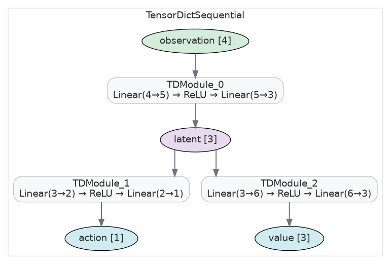
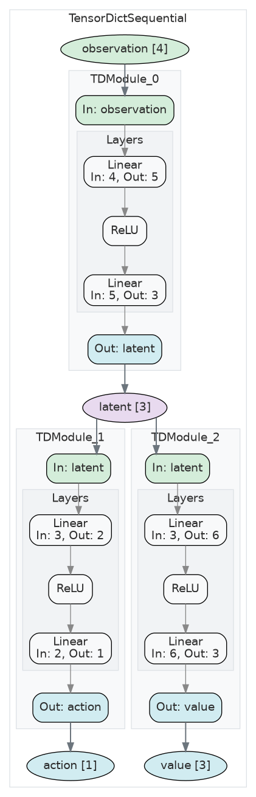
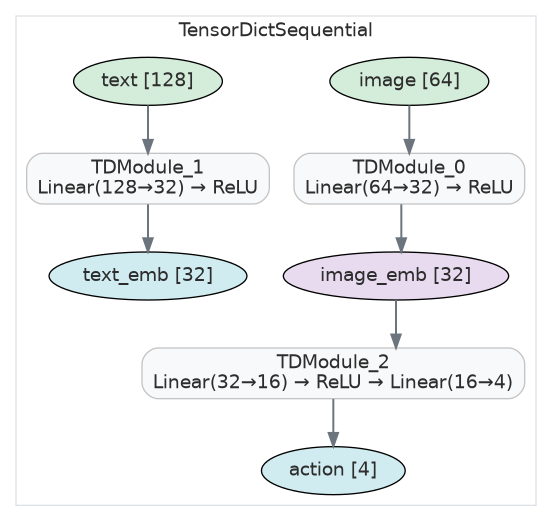
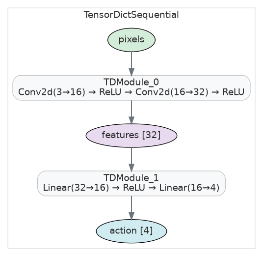
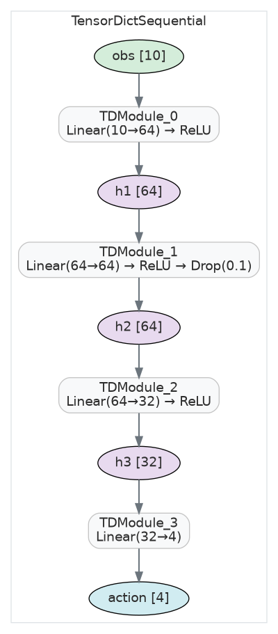
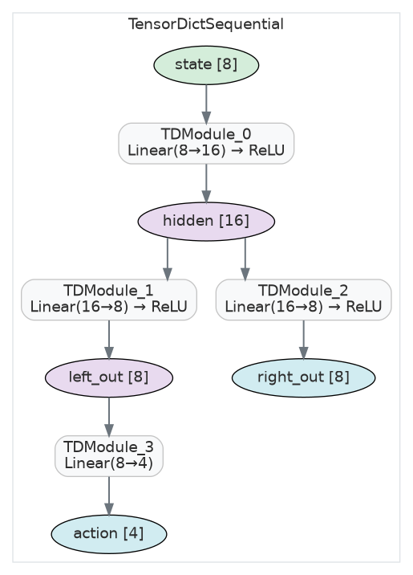
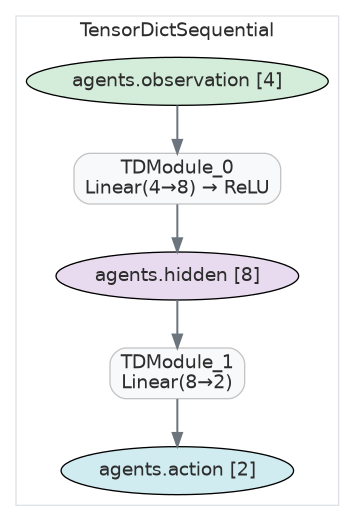
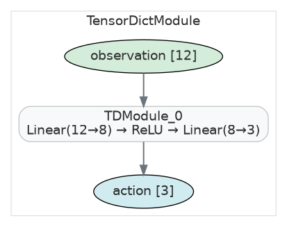
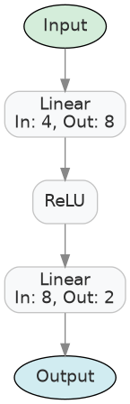

# tensordictviz

Visualize neural network architectures built with TorchRL's `TensorDictModule` and `TensorDictSequential`. Renders graph diagrams showing each module's input/output keys, internal layers, and tensor dimensions.

TorchRL wires modules together by matching output keys to input keys — a dataflow graph — but `print(model)` buries this structure in nested text. tensordictviz makes the data flow explicit.

## Installation

```bash
pip install tensordictviz
```

Requires [Graphviz](https://graphviz.org/download/) to be installed on your system.

## Quick Start

```python
from tensordictviz import ModelVisualizer
from torch import nn
from tensordict.nn import TensorDictModule, TensorDictSequential

encoder = nn.Sequential(nn.Linear(4, 5), nn.ReLU(), nn.Linear(5, 3))
head_a = nn.Sequential(nn.Linear(3, 2), nn.ReLU(), nn.Linear(2, 1))
head_b = nn.Sequential(nn.Linear(3, 6), nn.ReLU(), nn.Linear(6, 3))

model = TensorDictSequential(
    TensorDictModule(encoder, in_keys=["observation"], out_keys=["latent"]),
    TensorDictModule(head_a, in_keys=["latent"], out_keys=["action"]),
    TensorDictModule(head_b, in_keys=["latent"], out_keys=["value"]),
)

viz = ModelVisualizer(model=model)
viz.visualize()  # renders and saves as SVG
viz.view()       # opens in default viewer
```



Key nodes show tensor dimensions and are color-coded by role:
- **Green** — input keys (consumed but not produced)
- **Lavender** — intermediate keys (produced and consumed)
- **Blue** — output keys (produced but not consumed)

## Detail Modes

### Compact (default)

Each module is a single box with a layer summary chain:

```python
viz = ModelVisualizer(model=model)
viz.visualize(detail="compact")
```


### Full

Modules expand into clusters showing individual layers:

```python
viz = ModelVisualizer(model=model)
viz.visualize(detail="full")
```



## Architecture Examples

### Fan-in: multiple inputs merging

Two input streams (image + text) embedding into a shared space, then fused into a single output.

```python
model = TensorDictSequential(
    TensorDictModule(embed_img, in_keys=["image"], out_keys=["image_emb"]),
    TensorDictModule(embed_text, in_keys=["text"], out_keys=["text_emb"]),
    TensorDictModule(fuse, in_keys=["image_emb"], out_keys=["action"]),
)
```



### CNN + MLP

Conv2d feature extractor feeding into a linear head:

```python
cnn = nn.Sequential(
    nn.Conv2d(3, 16, kernel_size=3, padding=1), nn.ReLU(),
    nn.Conv2d(16, 32, kernel_size=3, padding=1), nn.ReLU(),
)
mlp = nn.Sequential(nn.Linear(32, 16), nn.ReLU(), nn.Linear(16, 4))

model = TensorDictSequential(
    TensorDictModule(cnn, in_keys=["pixels"], out_keys=["features"]),
    TensorDictModule(mlp, in_keys=["features"], out_keys=["action"]),
)
```



### Deep chain

Four modules in series with dropout:



### Diamond topology

Fan-out from a shared hidden state, then partial fan-in:



### Nested keys

Tuple keys like `("agents", "observation")` render as dot-separated names:

```python
model = TensorDictSequential(
    TensorDictModule(net1, in_keys=[("agents", "observation")], out_keys=[("agents", "hidden")]),
    TensorDictModule(net2, in_keys=[("agents", "hidden")], out_keys=[("agents", "action")]),
)
```



### Single TDModule

Works with a standalone `TensorDictModule` too:



### Plain nn.Sequential

Also supports standard PyTorch `nn.Sequential` (no TensorDict keys):



## API

```python
viz = ModelVisualizer(model=model, backend="graphviz")

viz.visualize(
    render=True,       # save to file (default: True)
    detail="compact",  # "compact" or "full"
)

viz.view(wait=False)   # open in system viewer
viz.clear()            # reset for reuse
```

## Supported Model Types

| Type | Visualization |
|------|---------------|
| `TensorDictSequential` | Dataflow graph with key nodes and module boxes |
| `TensorDictModule` | Same as above, single module |
| `nn.Sequential` | Linear chain: Input → layers → Output |
| `nn.Module` | Generic module with layer cluster |

## Gallery Script

Run the full gallery of test architectures:

```bash
python examples/gallery.py         # render all to /tmp/tviz_gallery/
python examples/gallery.py --open  # render and open in viewer
```
