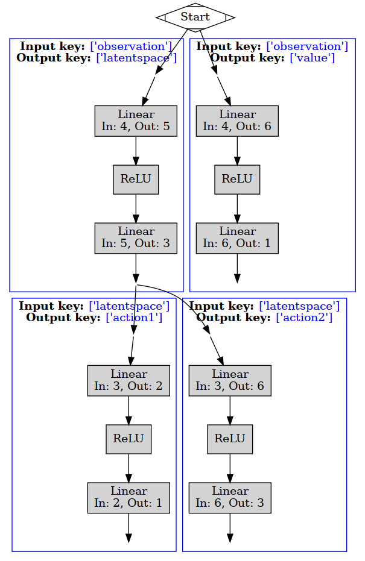

# TensorDictGraphViz


# Example

Define your network architecture: 

```
>>> model1 = nn.Sequential(nn.Linear(4, 5), nn.ReLU(), nn.Linear(5, 3))
>>> model2 = nn.Sequential(nn.Linear(3, 2), nn.ReLU(), nn.Linear(2, 1))
>>> model3 = nn.Sequential(nn.Linear(3, 6), nn.ReLU(), nn.Linear(6, 3))
>>> model4 = nn.Sequential(nn.Linear(4, 6), nn.ReLU(), nn.Linear(6, 1))

>>> seq_module3 = TensorDictSequential(
...     TensorDictModule(model1, in_keys=["observation"], out_keys=["latentspace"]),
...     TensorDictModule(model2, in_keys=["latentspace"], out_keys=["action1"]),
...     TensorDictModule(model3, in_keys=["latentspace"], out_keys=["action2"]),
...     TensorDictModule(model4, in_keys=["observation"], out_keys=["value"]),
... )

TensorDictSequential(
    module=ModuleList(
      (0): TensorDictModule(
          module=Sequential(
            (0): Linear(in_features=4, out_features=5, bias=True)
            (1): ReLU()
            (2): Linear(in_features=5, out_features=3, bias=True)
          ),
          device=cpu,
          in_keys=['observation'],
          out_keys=['latentspace'])
      (1): TensorDictModule(
          module=Sequential(
            (0): Linear(in_features=3, out_features=2, bias=True)
            (1): ReLU()
            (2): Linear(in_features=2, out_features=1, bias=True)
          ),
          device=cpu,
          in_keys=['latentspace'],
          out_keys=['action1'])
      (2): TensorDictModule(
          module=Sequential(
            (0): Linear(in_features=3, out_features=6, bias=True)
            (1): ReLU()
            (2): Linear(in_features=6, out_features=3, bias=True)
...
          out_keys=['value'])
    ),
    device=cpu,
    in_keys=['observation'],
    out_keys=['latentspace', 'action1', 'action2', 'value'])

```

Visualize your network:
```
td_viz = TensorDictVizGraph()
td_viz.build_graph(seq_module)
td_viz.view() # view the archiecture
# td_viz.render() # saving the image
```




# TODO:

- Make cluster same level that are "end" rank
- make arrows nicer to start/end at the cluster
- add final output keys 